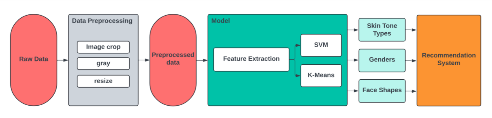
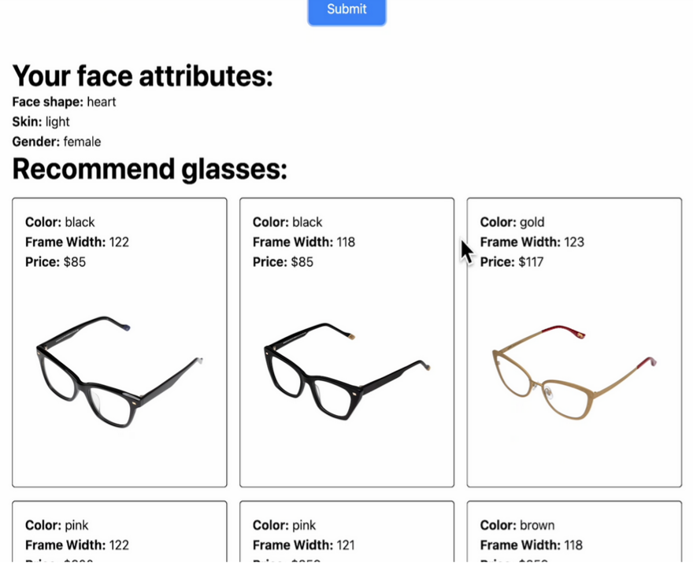

# Glasses's Frame Recommendation System
- Professor: ThS. Đỗ Văn Tiến (tiendv@uit.edu.vn)
- Course Id:  CS338.O22 (Nhận dạng)

## A glimpse of the project
<div align="center">
  
  <p><em>Figure 1: Project pipeline</em></p>
</div>

<div align="center">
  
  <p><em>Figure 2: Web demo</em></p>
</div>

## Explain
- `1*.ipynb`: Face shape Classification
- `2*.ipynb`: Skin Tone Classification
- `3*.ipynb`: Gender Classification
- `sample/`: contains image sample for inferencing
- `model/`: all of pretrained model used
- `glasses_dataset/`: glasses dataset for recommendation system
- `web/`: contains all the file to deploy web

## Deploy web 
```
cd web
python web/app.py
```
